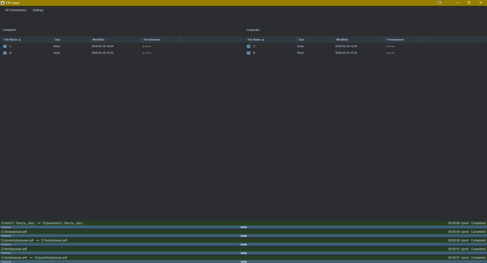
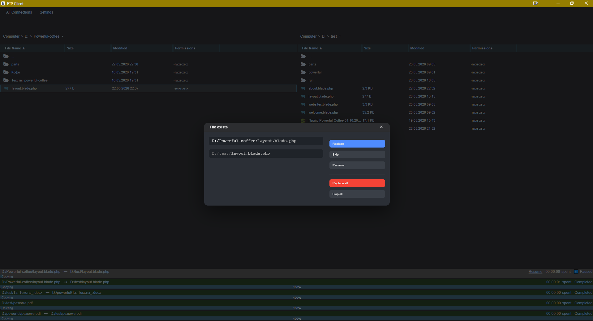

<div align="center">

<h1>🚀 Custom FTP Client</h1>

<p>
Modern FTP client built for file management, transfer queues, and remote server synchronization.
</p>


<br/>

<br/>
<br/>


</div>

---

<h2>✨ Features</h2>

<ul>
<li>📁 File upload & download</li>
<li>🔄 Transfer queue management</li>
<li>🌐 Remote directory synchronization</li>
<li>⚡ Reconnect & error handling</li>
<li>🖥️ Responsive user interface</li>
<li>📦 Large file operations support</li>
</ul>

---


<h3>Server Synchronization</h3>

<p align="center">

</p>

---

<h2>⚙️ Installation</h2>

```bash
git clone https://github.com/yourusername/ftp-client.git

cd ftp-client

composer install

cp .env.example .env

php artisan key:generate
```

<h3>Run application</h3>

```bash
php artisan serve
```

---

<h2>🗺️ Roadmap</h2>

<ul>
<li>[ ] SFTP support</li>
<li>[ ] Multi-server connections</li>
<li>[ ] Drag & drop uploads</li>
<li>[ ] Transfer history</li>
<li>[ ] Dark mode</li>
</ul>

---

<h2>💡 About</h2>

<p>
This project was developed as a custom solution for simplifying FTP workflows and remote file management operations.
</p>
